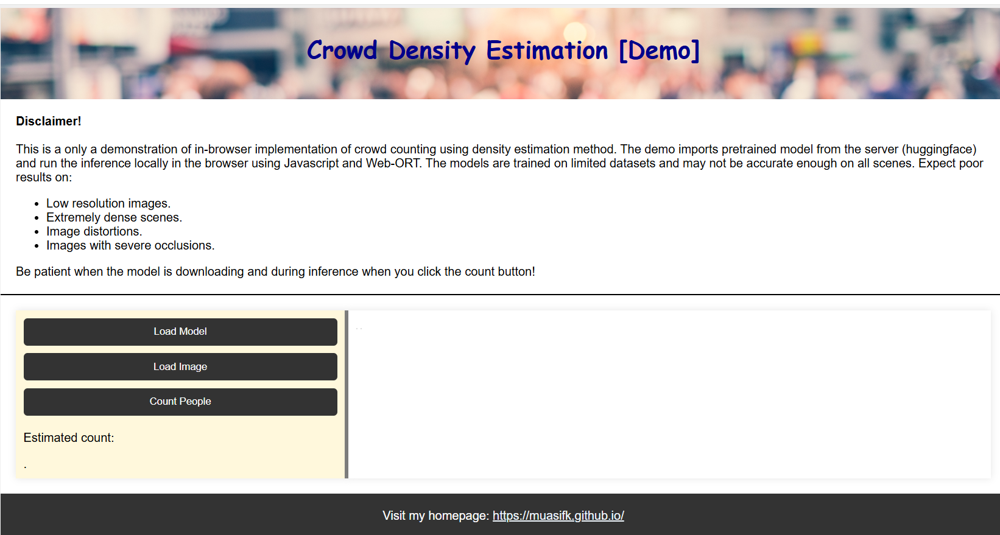

# Running a deep learning model in browser (locally)
This demo shows how you can run a crowd counting model in browser using Web-ORT and Javascript (no server upload)

<!-- !(./demo.jpg) -->

## How to use

Clone the repository:
`git clone https://github.com/muasifk/Demo_InBrowserInference.git`

Open the `index.html` file.

Click on <b>"Load Model"</b> button. Wait until the model is downloaded from 'www.huggingface.com'. It will take ~ a minute (the button will turn green and display "Loading Complete").

Click on <b>"Load image"</b> button. The button will turn green and the image be displayed.

Click on <b>"Count people"</b> button. It will take a few seconds to run the model. The density map will be displayed alongside the original image and the total count will be displayed.

## Using a different model

The model used in this demo is trained on a small dataset and uploaded to 'www.huggingface.com'. You may choose a different model by changing the link to the model in `script.js` file on `line 18-21`. Provide line to the model and run the `index.html`.

## Disclaimer!
The model is trained on a single dataset and may not be accurate enough on all scenes. Expect poor results on:
- Low resolution images.
- Extremely dense scenes.
- Image distortions.
- Images with severe occlusions.

<b> Be patient when the model is downloading and during inference when you click the count button! </b>